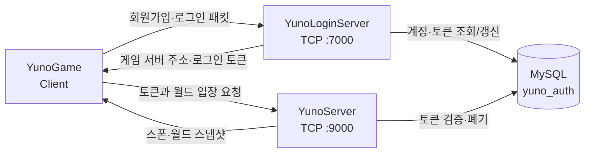

# MORPG Network Sample

`YunoEngine`에서 게임 전용 콘텐츠와 대용량 에셋을 덜어내고, C++ 서버 개발 역량을 확인할 수 있도록 네트워크·프로토콜·인증·데이터베이스 코드를 중심으로 정리한 기술 샘플입니다.

- 원본 프로젝트: [YunoEngine](https://github.com/DanJi-NaRi/YunoEngine)
- 목적: C++17 기반 비동기 TCP 통신, 서버 권한형 상태 동기화, MySQL 인증 흐름과 테스트 자동화 검증
- 실행 환경: Windows 10/11, Visual Studio 2022, x64

> 이 저장소는 별도의 완성 게임을 소개하기 위한 저장소가 아닙니다. 원본 프로젝트의 서버 기술을 검토하기 쉽도록 분리하고, 로그인 서버와 MySQL 연동 및 전송 계층 안정화 작업을 이어서 검증하는 포트폴리오용 코드베이스입니다.

## 핵심 기술

| 영역 | 구현 내용 |
| --- | --- |
| 비동기 네트워크 | Boost.Asio의 `async_accept`, `async_read`, `async_write` 기반 TCP 통신 |
| 세션 동시성 | 세션별 `strand`, 비동기 콜백 수명 관리를 위한 `shared_ptr`/`weak_ptr` |
| 패킷 프로토콜 | 고정 헤더와 가변 바디, Little Endian 직렬화, 패킷 타입 기반 디스패치 |
| 서버 권한형 동기화 | 서버에서 이동 입력을 검증하고 월드 스냅샷을 생성·브로드캐스트 |
| 인증 서버 | 회원가입, 로그인, 로그아웃, 중복 로그인 방지, 만료 토큰 발급·폐기 |
| 데이터베이스 | MySQL C API, 저장 프로시저, 외래 키·제약 조건 기반 스키마 |
| 보안 | Argon2id 비밀번호 해시, 레거시 비밀번호 해시 마이그레이션, 토큰 해시 저장 |
| 안정성 | 최대 패킷 크기, 송수신 예산, 전송 큐 한도, 유휴 세션 타임아웃 |
| 검증 | PowerShell 기반 빌드, 로그인/월드 진입 스모크, 전송 계층 회귀 테스트 |

## 프로젝트 관계와 범위

```text
YunoEngine
├─ 렌더링·엔진 시스템
├─ 게임 콘텐츠와 전용 규칙
└─ 네트워크·게임 서버 기반
          │
          └─ 게임 콘텐츠와 대용량 에셋 축소
             서버 기술 검증 항목 정리 및 확장
                         ↓
              MORPG_Network_Sample
```

이 저장소에서는 완성 게임의 콘텐츠보다 다음 항목을 검토할 수 있도록 구성했습니다.

- 공통 TCP 전송 계층과 세션 수명주기
- 패킷 경계 검증과 직렬화
- 로그인 서버와 게임 서버의 책임 분리
- MySQL 기반 계정·토큰·캐릭터·인벤토리 스키마
- 서버 권한형 이동 및 스냅샷 동기화
- 오류·과부하 상황을 고려한 전송 계층 방어 로직
- 반복 가능한 빌드와 스모크 테스트

## 전체 구조



### 모듈 구성

| 모듈 | 책임 |
| --- | --- |
| `YunoNetTransport` | TCP 서버·클라이언트, 세션, 비동기 송수신 큐 |
| `YunoNetProtocol` | 공통 패킷 헤더, 바이트 입출력, 인증 패킷, 디스패처 |
| `YunoGameProtocol` | 월드 입장·이동·스냅샷 등 게임 서버 프로토콜 |
| `YunoLoginServer` | 계정 생성, 로그인, 토큰 발급·폐기, MySQL 접근 |
| `YunoServer` | 토큰 검증, 플레이어 상태, 이동 입력 처리, 스냅샷 전송 |
| `YunoGame` | 로그인/게임 서버 접속, 패킷 송수신, 수신 큐 처리 |
| `scripts` | 빌드, 스모크, 프로토콜별 자동화 테스트 |
| `Result/Report` | 테스트 목적, 명령, 결과와 핵심 로그를 기록한 보고서 |

## 주요 처리 흐름

### 1. 회원가입과 로그인

1. 클라이언트가 로그인 서버에 비동기 TCP로 접속합니다.
2. 서버가 패킷 헤더의 타입과 바디 길이를 검증하고 인증 요청을 역직렬화합니다.
3. 로그인 서버가 MySQL 저장 프로시저를 호출해 계정을 생성하거나 자격 증명을 확인합니다.
4. 신규 비밀번호는 Argon2id로 해시하며, 기존 형식의 비밀번호는 로그인 성공 시 Argon2id로 마이그레이션합니다.
5. 로그인에 성공하면 만료 시간이 있는 토큰을 발급하고, 게임 서버 주소와 함께 클라이언트에 전달합니다.
6. 로그아웃 요청 또는 게임 서버 입장 완료 시 토큰을 폐기합니다.

관련 코드:

- [`YunoLoginServer/LoginNetwork/YunoLoginServerNetwork.cpp`](YunoLoginServer/LoginNetwork/YunoLoginServerNetwork.cpp)
- [`YunoLoginServer/LoginData/MySqlAuthRepository.cpp`](YunoLoginServer/LoginData/MySqlAuthRepository.cpp)
- [`YunoLoginServer/Sql/init_yuno_auth.sql`](YunoLoginServer/Sql/init_yuno_auth.sql)

### 2. 게임 서버 입장과 상태 동기화

1. 클라이언트가 로그인 서버에서 받은 토큰으로 게임 서버에 월드 입장을 요청합니다.
2. 게임 서버가 MySQL에서 토큰의 유효 기간과 폐기 여부를 확인합니다.
3. 인증된 세션에 플레이어 런타임 상태와 엔티티 ID를 할당합니다.
4. 클라이언트의 이동 입력은 서버가 순서와 빈도를 검증한 뒤 상태에 반영합니다.
5. 서버는 20 Hz 주기로 월드 스냅샷을 생성해 접속 중인 클라이언트에 전송합니다.
6. 클라이언트는 마지막 수신 스냅샷 ID를 ACK로 보내 처리 상태를 공유합니다.

관련 코드:

- [`YunoServer/ServerNetwork/YunoServerNetwork.cpp`](YunoServer/ServerNetwork/YunoServerNetwork.cpp)
- [`YunoGame/ClientNetwork/YunoClientNetwork.cpp`](YunoGame/ClientNetwork/YunoClientNetwork.cpp)
- [`YunoGame/Game/WorldPlayerState.h`](YunoGame/Game/WorldPlayerState.h)

### 3. 비동기 TCP 세션

`TcpSession`은 패킷 헤더와 바디를 분리해서 읽고, 세션별 `strand`를 통해 송수신 콜백과 큐 변경 순서를 직렬화합니다.

- 8바이트 고정 헤더 선행 수신
- 최대 바디 크기 4 MiB 검증
- 세션별 초당 패킷 수와 수신 바이트 예산 적용
- 최대 1,024개·8 MiB의 송신 큐 제한
- 30초 유휴 세션 타임아웃
- 연결 종료 콜백의 중복 실행 방지
- 브로드캐스트 패킷의 공유 소유권을 통한 복사 감소

관련 코드:

- [`YunoNetTransport/Private/Net/TcpSession.cpp`](YunoNetTransport/Private/Net/TcpSession.cpp)
- [`YunoNetTransport/Private/Net/TcpServer.cpp`](YunoNetTransport/Private/Net/TcpServer.cpp)
- [`YunoNetProtocol/Public/Net/PacketHeader.h`](YunoNetProtocol/Public/Net/PacketHeader.h)
- [`YunoNetProtocol/Public/Net/ByteIO.h`](YunoNetProtocol/Public/Net/ByteIO.h)

## 데이터베이스

`YunoLoginServer/Sql/init_yuno_auth.sql`은 다음 데이터를 관리합니다.

- `users`: 사용자 계정과 비밀번호 해시
- `login_tokens`: 사용자별 활성 로그인 토큰과 만료·폐기 상태
- `characters`: 계정별 캐릭터 기본 정보
- `items`: 아이템 원형 데이터
- `inventory_items`: 캐릭터의 슬롯별 아이템 상태

인증과 토큰 처리는 저장 프로시저로 분리했습니다.

- 사용자 인증과 레거시 해시 판별
- Argon2id 해시로의 점진적 마이그레이션
- 계정 생성
- 로그인 토큰 발급·갱신·조회·폐기
- 최근 로그인 시각 갱신

## 빌드 환경

### 요구 사항

- Windows 10 또는 11
- Visual Studio 2022와 MSVC C++ 빌드 도구
- Windows 10/11 SDK
- C++17
- MySQL Server 8.x 및 MySQL C API
- vcpkg

`vcpkg.json`의 주요 의존성은 다음과 같습니다.

- Boost.Asio
- Boost.System
- Argon2
- PhysX

### 환경 변수

실행 전 실제 개발 환경에 맞는 값을 설정합니다. 비밀번호와 토큰은 저장소에 커밋하지 않습니다.

```powershell
$env:MYSQL_DIR = 'C:\Path\To\MySQL'
$env:YUNO_DB_HOST = '127.0.0.1'
$env:YUNO_DB_PORT = '3306'
$env:YUNO_DB_USER = 'your_user'
$env:YUNO_DB_PASS = 'your_password'
$env:YUNO_DB_NAME = 'yuno_auth'
$env:YUNO_GAME_HOST = '127.0.0.1'
$env:YUNO_GAME_PORT = '9000'
$env:YUNO_LOGIN_TOKEN_TTL = '1800'
```

### 데이터베이스 초기화

MySQL 클라이언트에서 다음 스크립트를 실행합니다.

```powershell
mysql -u your_user -p < .\YunoLoginServer\Sql\init_yuno_auth.sql
```

### 빌드

```powershell
powershell -ExecutionPolicy Bypass -File .\scripts\build_and_test.ps1 -Configuration Debug -Platform x64
```

빌드 스크립트는 다음 타깃을 순서대로 검증합니다.

1. `YunoNetProtocol`
2. `YunoGameProtocol`
3. `YunoLoginServer`
4. `YunoServer`
5. `YunoGame`

## 테스트

### 로그인 서버·게임 서버 스모크

```powershell
powershell -ExecutionPolicy Bypass -File .\scripts\smoke_world_enter.ps1 -Configuration Debug -Platform x64
```

### 전송 계층 안정성 회귀 테스트

```powershell
powershell -ExecutionPolicy Bypass -File .\scripts\test_transport_hardening.ps1
```

테스트 결과는 다음 위치에 저장합니다.

- 실행 로그: `Result/Log`
- 분석 보고서: `Result/Report`

최근 전송 계층 검증 보고서:

- [`Result/Report/20260409_204805_transport_hardening_report.md`](Result/Report/20260409_204805_transport_hardening_report.md)

## 코드 리뷰 시작 지점

전체 코드를 순서대로 확인하려면 다음 파일부터 보는 것을 권장합니다.

1. [`YunoNetTransport/Public/Net/TcpSession.h`](YunoNetTransport/Public/Net/TcpSession.h)
2. [`YunoNetTransport/Private/Net/TcpSession.cpp`](YunoNetTransport/Private/Net/TcpSession.cpp)
3. [`YunoNetTransport/Private/Net/TcpServer.cpp`](YunoNetTransport/Private/Net/TcpServer.cpp)
4. [`YunoNetProtocol/Public/Net/PacketHeader.h`](YunoNetProtocol/Public/Net/PacketHeader.h)
5. [`YunoLoginServer/LoginNetwork/YunoLoginServerNetwork.cpp`](YunoLoginServer/LoginNetwork/YunoLoginServerNetwork.cpp)
6. [`YunoLoginServer/LoginData/MySqlAuthRepository.cpp`](YunoLoginServer/LoginData/MySqlAuthRepository.cpp)
7. [`YunoServer/ServerNetwork/YunoServerNetwork.cpp`](YunoServer/ServerNetwork/YunoServerNetwork.cpp)
8. [`scripts/test_transport_hardening.ps1`](scripts/test_transport_hardening.ps1)

## 설계 선택과 대안

### Boost.Asio 기반 비동기 TCP

- 선택: 하나의 전송 계층에서 서버와 클라이언트의 비동기 연결·송수신을 처리했습니다.
- 대안: Windows IOCP를 직접 사용하거나, 메시지 브로커 기반 통신을 사용할 수 있습니다.
- 이유: 운영체제별 세부 API보다 세션·패킷·오류 처리 설계에 집중하면서도 비동기 I/O의 핵심을 구현할 수 있기 때문입니다.

### 로그인 서버와 게임 서버 분리

- 선택: 계정 인증과 토큰 발급은 로그인 서버, 월드 상태는 게임 서버가 소유합니다.
- 대안: 하나의 서버 프로세스에서 인증과 게임 상태를 모두 처리할 수 있습니다.
- 이유: 영구 계정 데이터와 실시간 게임 상태의 책임과 장애 범위를 분리하고, 이후 서버를 독립적으로 확장하기 쉽기 때문입니다.

### 서버 권한형 상태 동기화

- 선택: 클라이언트는 입력을 보내고 최종 위치와 스냅샷은 서버가 결정합니다.
- 대안: 클라이언트가 계산한 위치를 그대로 중계할 수 있습니다.
- 이유: 클라이언트 간 상태 불일치와 비정상 입력 반영을 줄이고, 동일한 서버 상태를 기준으로 판정하기 위해서입니다.

## 현재 한계와 개선 방향

이 저장소는 구조 검증 단계의 샘플이며 다음 한계가 있습니다.

- MySQL 쿼리가 동기 방식이므로 DB 지연이 서버 이벤트 처리에 영향을 줄 수 있습니다.
- 로그인 서버와 게임 서버가 각각 단일 프로세스로 동작하며 수평 확장과 서버 디스커버리는 구현하지 않았습니다.
- TCP 구간 암호화가 적용되지 않아 외부 서비스 환경에서는 TLS 계층이 필요합니다.
- 월드 상태가 메모리에만 존재하므로 프로세스 재시작 시 복구되지 않습니다.
- 현재 스모크 테스트는 실제 프로토콜 왕복보다 프로세스 생존성 검증 비중이 큽니다.

다음 단계에서는 아래 항목을 우선 개선할 계획입니다.

1. DB 작업 큐와 워커 스레드 또는 비동기 DB 계층 도입
2. 커넥션 풀, 쿼리 타임아웃과 재시도 정책 추가
3. TLS와 보안 난수 기반 토큰 발급 적용
4. 실제 로그인·월드 진입 왕복을 검증하는 기능 테스트 추가
5. 동시 접속·패킷 부하 테스트와 p95/p99 지연시간 측정
6. 구조화 로그, 메트릭과 정상 종료 절차 보강

## License

이 저장소의 라이선스는 [`LICENSE`](LICENSE)를 따릅니다.
